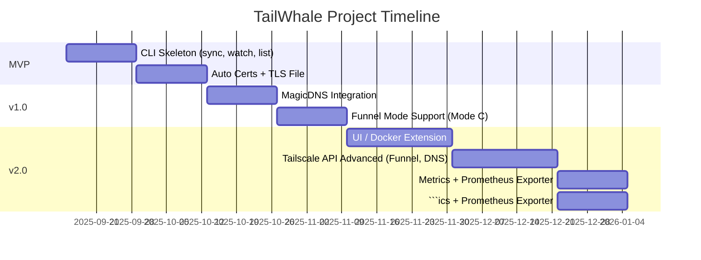

# TailWhale


A tool to automatically sync **Tailscale certificates**, **Traefik routing**, and optionally **DNS/Funnel exposure** for Docker containers — expose services over your tailnet or Internet via HTTPS, with zero manual label editing required.  

---

## 🎯 What is it

TailWhale is a sidecar/companion service + CLI + optional UI that runs alongside Docker & Traefik.  

It watches your Docker environment, identifies containers you want to expose, uses **Tailscale** to issue SSL certificates, and updates a `tls.yml` file that Traefik watches (hot reloaded).  

With **MagicDNS** enabled, TailWhale generates hostnames for your containers so they are reachable inside the tailnet.  
With **Funnel**, you can expose Traefik itself directly on the Internet with HTTPS automatically handled by Tailscale.  

Official website: [https://tailwhale.sh](https://tailwhale.sh)  

---

## ⚙️ Features

- 🔍 Auto-discovery of containers to expose  
- 🔐 Automatic certificate issuance via Tailscale  
- 🔄 Dynamic Traefik TLS config (hot reload)  
- 🖥 CLI & Daemon (watch mode)  
- 🌐 Optional Web UI / Docker Desktop Extension  
- 🌱 MagicDNS integration  
- 🐳 Three exposure modes:  
  - **Mode A**: Host + Traefik (default)  
  - **Mode B**: Per-container sidecar  
  - **Mode C**: Funnel on Traefik (public exposure)  

---

## 🔍 Modes Explained

### Mode A — Host + Traefik
- One Tailscale node (the host).  
- Containers exposed via Traefik routing.  
- Hostname pattern:  
  ```
  <container>.<host>.<tailnet>.ts.net
  ```

### Mode B — Per-Container Sidecar
- Each container runs its own Tailscale sidecar.  
- Each container is an independent node.  
- Hostname pattern:  
  ```
  <container>.<tailnet>.ts.net
  ```

### Mode C — Funnel on Traefik
- Tailscale Funnel enabled on Traefik container.  
- Exposes Traefik publicly on Internet with TLS managed by Tailscale.  
- Hostname pattern:  
  ```
  https://<host>.ts.net
  ```

---

## 🧩 Architecture

- `core/` — discovery, naming, mode selection  
- `docker/` — container list, events  
- `tailscale/` — certs, MagicDNS checks, Funnel setup  
- `traefik/` — TLS file writer (Mode A only)  
- `cmd/tailwhale` — CLI  
- `cmd/extension-api` — REST backend for UI  
- `ui/` — Next.js frontend  

---

## 🚀 Getting Started

### Prerequisites
- Tailnet with MagicDNS enabled  
- Tailscale installed on host (Mode A)  
- Or sidecar Tailscale containers (Mode B)  
- Or Funnel enabled on host/container (Mode C)  

### CLI usage (current)
```bash
# one-off sync: discover → issue cert paths → write traefik/tls.yml
tailwhale sync \
  --host host1 --tailnet tn \
  --tls-path traefik/tls.yml --cert-dir /var/lib/tailwhale/certs 

# watch: prefer Docker events (when built with tag `docker`), fallback to interval
tailwhale watch \
  --host host1 --tailnet tn \
  --tls-path traefik/tls.yml --cert-dir /var/lib/tailwhale/certs \
  --interval 10s

# list: show resolved services; load containers from JSON for offline dev
tailwhale list --json
tailwhale list --from-file ./examples/containers.json
```

Makefile demo
- Run `make demo` to list services from `examples/containers.json` and write a preview TLS file to `/tmp/tailwhale_tls.yml` using `examples/tailwhale.json`.

Config file (optional)
- Pass `--config examples/tailwhale.json` to `sync`/`watch` to set `host`, `tailnet`, `tlsPath`, `certDir`.
- Flag values override file values.
```json
{
  "host": "host1",
  "tailnet": "tn",
  "tlsPath": "traefik/tls.yml",
  "certDir": "/var/lib/tailwhale/certs"
}
```

### Docker CLI plugin usage
```bash
docker tailwhale expose myapp --host myapp.ts.net
docker tailwhale list
```

---

## 🧪 Build Notes

- Default build uses a fake Docker provider (no external deps).  
- To use the real Docker provider, build with tag `docker`:
  ```bash
  go build -tags docker ./cmd/tailwhale
  ```
  Watch mode will then react to Docker events and rewrite `tls.yml` atomically.

### Optional TUI (Bubble Tea)
- A minimal terminal UI is scaffolded behind the `tui` build tag using Bubble Tea.
- Install deps and build:
  ```bash
  # add dependency once (when you want to build the TUI)
  go get github.com/charmbracelet/bubbletea@latest
  # build the TUI binary (tagged to avoid affecting default CI builds)
  go build -tags tui ./cmd/twui
  ./twui
  ```
  The TUI lists discovered services and supports `r` to refresh and `q` to quit.

---

## 🔮 Roadmap

- [ ] Auto certs with Tailscale  
- [ ] Dynamic TLS config for Traefik  
- [ ] CLI toggle for exposure mode (A, B, C)  
- [ ] Funnel automation (start/stop, status)  
- [ ] UI for toggling exposure per service  
- [ ] Integration with Tailscale API (MagicDNS, Funnel)  
- [ ] Docker Desktop Extension packaging  
- [ ] Metrics & observability  

---

## 📅 Planning (Gantt)



---

## 🛡 License

TailWhale is released under the **MIT License**.  
See the [LICENSE](./LICENSE) file for full details.  
